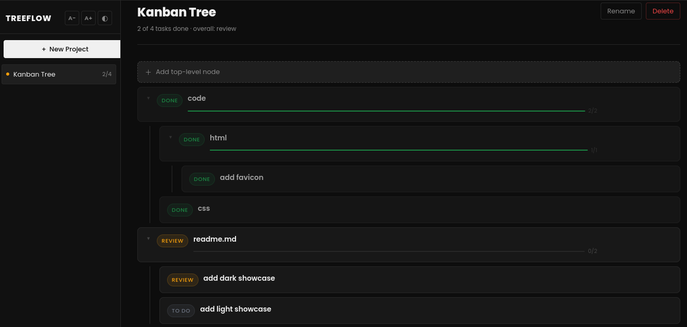
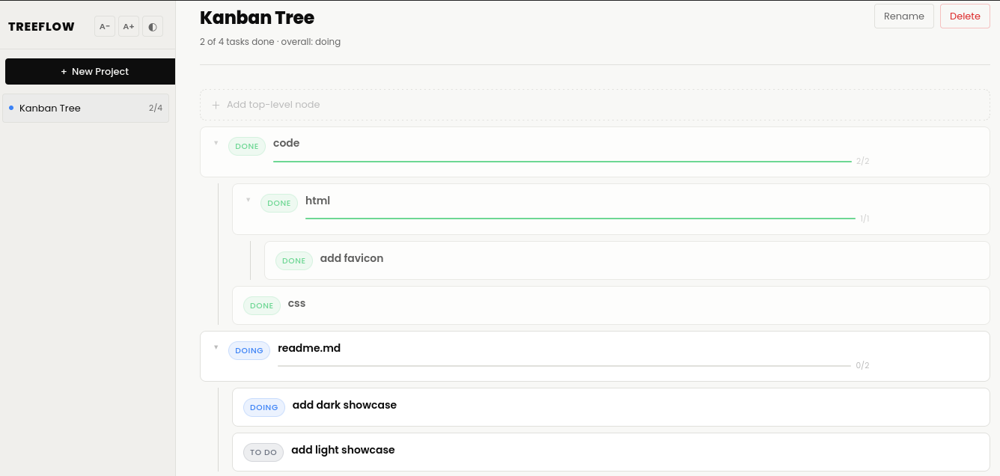

# Kanban Tree 🎋

A minimalist Kanban website but organized as a tree 🌳. 

[Link 🌐: https://pilotleoyan.github.io/kanban-tree/](https://pilotleoyan.github.io/kanban-tree/)

**features:**

1. 📁 Create different projects, each with its own tasks.
2. 📝 Create tasks as nodes, each with a title a description.
3. 🔵 Each node can have its own subnodes.
4. 🚦 Move tasks between **ToDO, Doing, and Done**.
5. 💻️ All information is stored locally.
6. ☀️ Switch between **Dark** and **Light** themes.
7. 🔓️ Open-source, edit that you want.

Give me a star ⭐️ please :D

## showcase

  
Dark theme.

  
Light theme.

## download code

1. [🗒️ Download the code here](https://github.com/PilotLeoYan/kanban-tree/archive/refs/heads/main.zip)
2. Extract the files from the .zip file.
3. Feel free to delete any unnecessary files, such as the *README.md* and *showcase/* folder. Do not delete **index.html** or **src/** folder.
